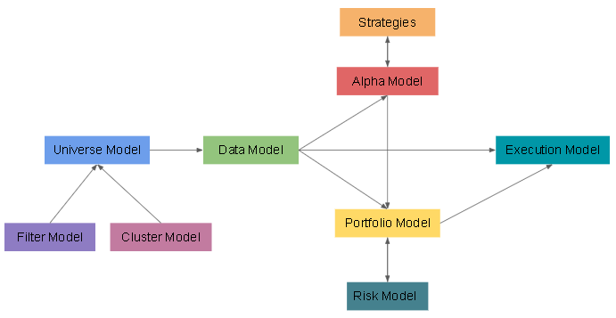

### Algorithm Framework and Software Architecture -- High-level Overview

Quantitative trading systems are highly complex in nature. Between the time fresh market data is fed into the system, until an order is sent to the exchange, there are many moving components communicating with each other: from data collection and preprocessing, to emiting signals based on indicators, risk management of portfolio, to order execution etc.

In order to manage this high complexity, institutions commonly practice __modularisation__, breaking down complex systems into simple, interchangeable modules. By allocating specific purposes to each module, the software architecture becomes much more coherent and maintainable.

While practices across institutions vary, most would follow a general framework with similar core features, which are:
1. Universe Model -- Selecting which securities to trade.
2. Data Model -- Collecting market data and propagating to other models.
3. Alpha Model -- Generate trading signals based on indicators.
4. Portfolio Model -- Determine position sizing based on firm equity, risk evaluations.
5. Execution Model -- Executes orders to achieve desired portfolio.

References:
- M. Lopez de Prado. Advances in Financial Machine Learning. John Wiley & Sons, Inc.
- K. Rishi Narang. Inside the Black Box. John Wiley & Sons, Inc.
- QuantConnect:  https://www.quantconnect.com/docs/algorithm-framework/overview