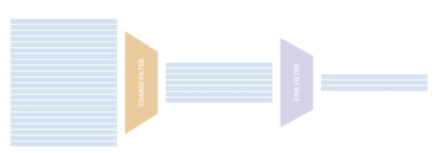

### Filtering -- selecting liquid securities to minimise execution risk.

A core component of algorithmic trading strategies
is __universe selection__. Ideally, we want to select
the most liquid securities in the universe,
to minimise execution risk (transaction costs,
 adverse selection, inventory risk etc.)

As explained by Larry Harris, liquidity has multiple
dimensions:
1. Immediacy - How quickly trades can be executed
2. Width - Transaction cost of making a trade
3. Depth - Size of a trade that can be arranged at a given cost.

Immediacy can be difficult to quantify, so we instead focus
on Width and Depth. The historical traded market value
of a security can be a surrogate for depth, while width
may be estimated by relative spread. Market cap may also
be used to measure liquidity.

More sophisticated filtering models will include both a basic
market value/relative spread filter (coarse layer), followed by
fundamental analysis (P/E ratio, forecasted returns)
of securities (fine layer).

|  | 
|:--:|
|*Illustration of filtering layers. Source: QuantConnect* |

  
References:
- L. Harris. Trading & Exchanges. Oxford University Press, Inc.
- R. Kissell. Algorithmic Trading Methods. Academic Press, Elsevier Inc.
- H. Demsetz. "The Cost of Transacting". The Quarterly Journal of Economics 82 (1): 33-53
- QuantConnect: https://www.quantconnect.com/docs/algorithm-reference/universes
