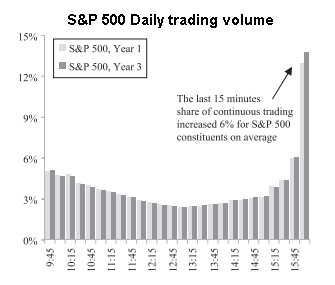

### Sampling -- aggregating information uniformly via the volume clock

Data collection and preprocessing comes as the first step of any algorithmic trading strategy.
In order to perform any statistical tests and mathematical analysis, we need to start by parsing
unstructured data, extracting valuable information from  it, and storing those extractions in a
regularized format.

Practitioners use __bars__, a tabular representation of the extracted data to build their trading
strategies. These bars aggregate OHLCV (open, high, low, close, volume) information and are often
sampled at fixed time intervals, e.g. once every minute. Such bars are known formally as __time bars__,
and are perhaps the most popular representations amongst practitioners and academics alike.

Despite its popularity, there are several reasons why this practice should be avoided. For one, trading
volume varies throughout the day. The hour following exchange opens, and the hour just before exchange closes
is much more active than the hour around noon, a phenomenon coined by practitioners as the __volume smile__.
This means that time bars over-sample information during low activity periods and under-sample
information during high activity periods. Furthermore, time bars often exhibit poor
statistical properties, like serial correlation, heteroscedasticity, and non-normality of
returns.

|  | 
|:--:|
|*Median percent of volume traded every 15 minutes, over a period of 1(3) years. Source: Barclays* |

In order to avoid these problems, the general idea is to create bars that sample information uniformly.
While "information" may be hard to quantify, we may choose to use trading volume as a
surrogate for information. The approach of forming bars as a subordinated process of trading activity
is referred to as the __volume clock__.

An alternative approach to the __volume clock__ is to use __information-driven bars__, which aims to sample bars
based on imbalance in buy and sell activities. Such an approach is beyond the scope of this project.

  
References:
- M. López de Prado. Advances in Financial Machine Learning. John Wiley & Sons, Inc.
- Easley, D., M. López de Prado, and M. O’Hara. “The
Volume Clock: Insights into the High Frequency Paradigm.”
The Journal of Portfolio Management 37 (2): 118–128.
- I. Grynkiv, K. Russell "A Look Inside the Shifting
Volume Smile for U.S. Equities." The Journal of Trading Winter 11 (1): 26-37

